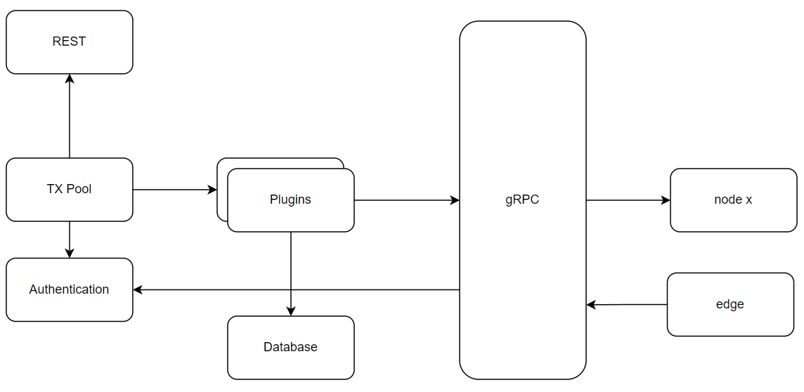

# zFusion是一个数字化资产素流转框架

# 设计理念
## 何为数字化资产

数字化资产是有价值的、用电子信息表示的资产。可分3种类型。
1. 实体资产的数字化形式。例如电商平台上的一双鞋子、一部笔记本电脑；
2. 数字化作品。数字音乐、电话、绘画、小说等；
3. 权益的数字化证明。电子机票表示拥有乘坐某航班的权利，数字化股票表示拥有某公司一定数量的股份等。

一份数字化资产属某个或者多个个人、组织拥有。

## 数字标识
数字资产与实体资产一样，具有一定的价值，因此必须对其进行标识以方便识别、使用、利用。

## 流转模型
与复制一份数据不同，转移或者复制数字化资产时，需要先执行某些动作，例如授权。因此，zFusion采用request-response的模式完成这些动作的执行。

# 系统架构

zFusion是一个分布式网络系统，由如果节点组成，节点之间通过gRPC通信。
边缘节点也可以通过gRPC直接与节点交互完成业务。
个人或者业务系统可以通过节点的REST服务与节点通信。

## 插件 
数字化资产的类型、需要的处理方式多种多样，在zFusion中采用插件以应对各种各样的资产类型。例如一个插件可以接收、处理裸数据形式的资产，另一插件可以对数字化资产可以加密、解密、进行隐私计算等等。
在zFusion中，任意多个插件可以串行、并行，以及串行、并行的任意组合以满足不同业务需要。
